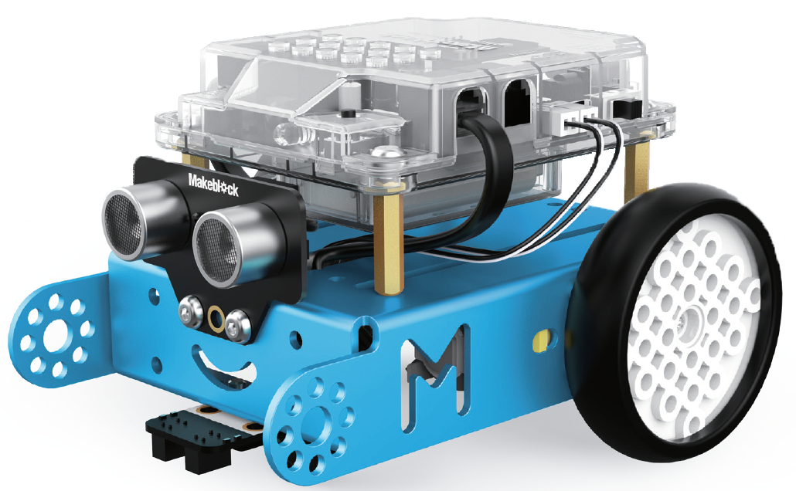

# MBot Microsite

## About the mBot

The mBot is a $70.00 USD STEM coding robot for beginning programmers.  It is programed by dragging and placing simple blocks, so even kids that don't know how to type can program the mBot.  If you know [Scratch](glossary#scratch) programming you can quickly learn to programm the mBot.

## About this Website

This web site contains basic lesson plans for teaching [Computational Thinking](glossary#computational-thinking) to students in the age range of 5 to 12 years old.  They key is that student don't need to know how to use a keyboard to use the mBot.  Once students can use a keyboard they should advance to [Beginning Python](https://www.coderdojotc.org/python/).

The website is designed to contain modular lesson plans that teachers are free to use and customize for their classrooms without any license fees.  All our content on the CoderDojo Twin Cities is covered under the [Creative Commons Sharealike Noncommercial License](glossary#creative-commons-license)

Please [Conaact](contact) me if you have any questions.  We are always looking for volunteers to help us add lesson plans to this site.

- Dan McCreary, site maintainer

